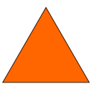
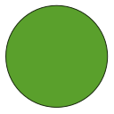

# Robots
#### A prototype to explore gameplay mechanics

## Units

### (Need Name) "Resources"
This unit exclusively collects resources and brings them to available storage locations.

### (Need Name) "Plan" 
This unit exclusively lays out blue prints. Tentative.

### (Need Name) "Action" 
This unit exclusively wanders around to places where blueprints are laid out and constructs them by collecting resources from the storage location and brings them to the build site.

## Buildings
- Storage Pyramid
- Planning Ziggaraut